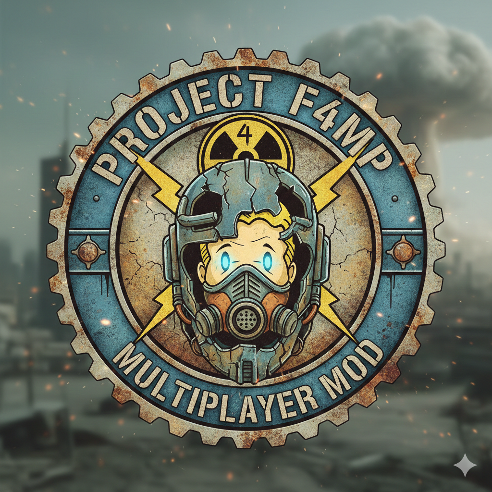

# Project F4MP - Fallout 4 Multiplayer Mod

  

---

## ☢️ Sobre el Proyecto
**Project F4MP** es una ambiciosa modificación para **Fallout 4** que introduce capacidades multijugador en el Commonwealth. Explora el yermo, completa misiones y sobrevive a los peligros post-apocalípticos junto a tus amigos.

## ✨ Características Principales
* **Sincronización en Tiempo Real:** Jugadores, NPCs y clima sincronizados.
* **Mundo Persistente:** Servidores dedicados para una experiencia continua.
* **Compatibilidad:** Diseñado para trabajar con una amplia selección de mods de la comunidad.
* **Estilo Pip-Boy:** Interfaz integrada fiel a la estética de Bethesda.

## 🚀 Instalación
1.  Descarga la última versión desde la sección de [Releases](../../releases).
2.  Extrae el contenido en tu carpeta raíz de **Fallout 4**.
3.  Ejecuta `F4MP_Launcher.exe`.
4.  ¡Conéctate a un servidor y empieza a jugar!

## 🛠️ Requisitos
* Fallout 4 (Versión de Steam/GOG actualizada).
* F4SE (Fallout 4 Script Extender).
* Una conexión a internet estable.

## 🤝 Contribuir
¿Quieres ayudar a reconstruir el mundo? ¡Las contribuciones son bienvenidas!
* Reporta bugs en el apartado de **Issues**.
* Propón nuevas ideas en **Discussions**.
* Revisa nuestro sitio web oficial: [f4mp.joustech.space](https://f4mp.joustech.space/)

---

  Hecho con ❤️ por la comunidad de Project F4MP.

